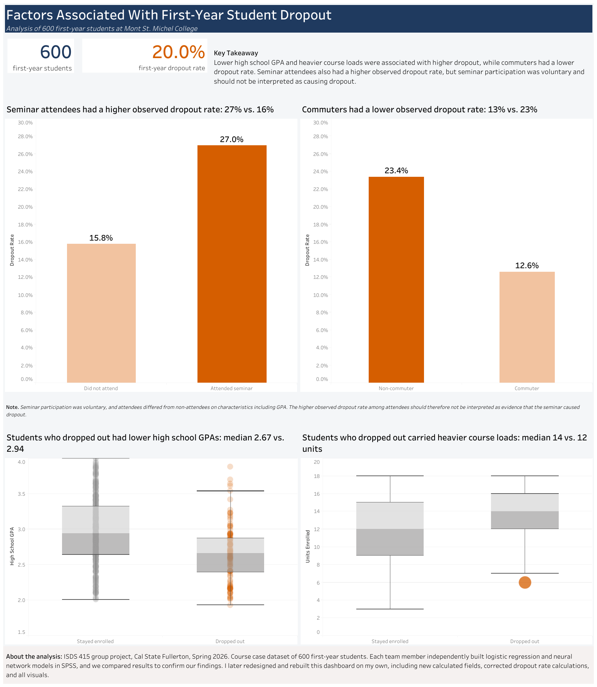
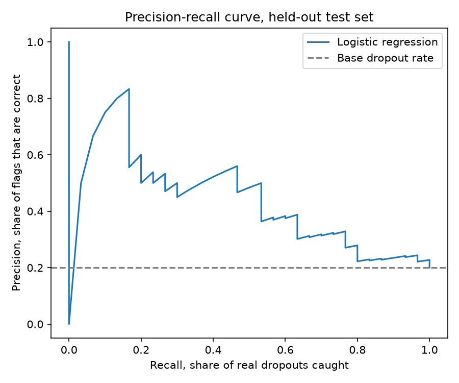
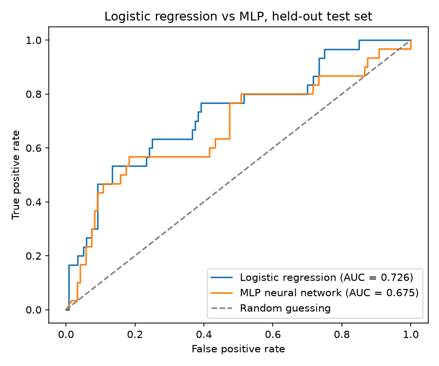
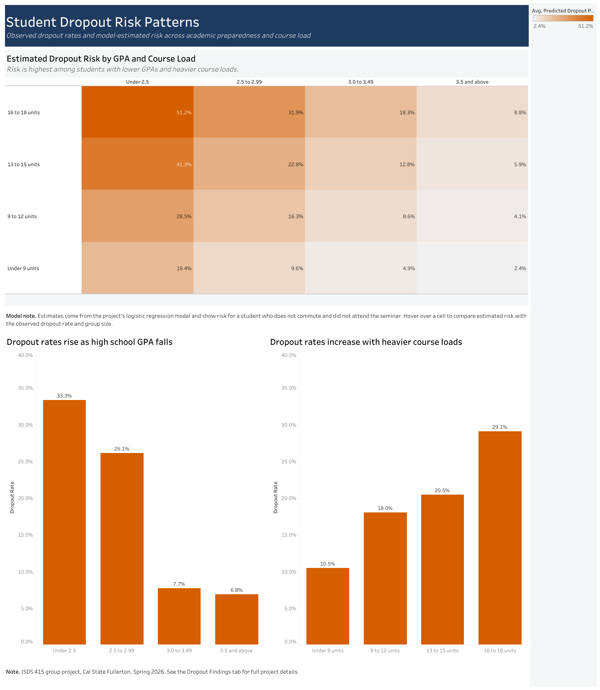

# Student Dropout Analysis

**Which first-year students are most likely to drop out, and is the college's first-year seminar helping?**

Analysis of 600 first-year student records from a case-study college, covering observed retention patterns, predictive modeling, and an interactive Tableau dashboard built for administrators.

**[View the interactive dashboard →](https://public.tableau.com/views/StudentDropoutAnalysis_17897246641970/StudentDropoutRiskPatterns?:language=en-US&:sid=&:redirect=auth&:display_count=n&:origin=viz_share_link)**



**Tools** Python (scikit-learn, pandas, matplotlib), Tableau, SPSS, Excel
**Methods** Exploratory analysis, logistic regression, multilayer perceptron, cross-validation, threshold tuning, dashboard design

---

## Background

One in five first-year students at the college did not return after their first year. Administrators wanted to know which students were most at risk, and whether the voluntary first-year seminar was improving retention.

## Data

600 first-year student records from Spring 2026. Each record contains high school GPA, units enrolled, age, gender, registration status, commuter status, first-year seminar attendance, and whether the student dropped out. No missing values. This is a course case dataset rather than real institutional records.

## Findings

**High school GPA was the strongest predictor of dropout.** Students who left averaged a 2.66 GPA against 2.97 for those who stayed. Dropout fell steadily as GPA rose, from 33% among students below a 2.5 to 7% among students at 3.5 and above.

**Heavier course loads were associated with more dropout, not less.** Students who left carried 13.5 units on average against 12.2 for those who stayed. Dropout climbed from 11% among students taking fewer than 9 units to 29% among those taking 16 to 18.

**Commuters were retained at higher rates.** 13% of commuters dropped out, against 23% of non-commuters.

**Seminar attendees dropped out more often, but the comparison is confounded.** 27% of attendees left, against 16% of non-attendees. A second logistic regression predicting attendance showed that students with lower GPAs were significantly more likely to attend, so attendees were already at higher risk before the seminar began. Because attendance was voluntary, the difference cannot be read as an effect of the seminar.

**The highest-risk group is students with both risk factors.** Estimated dropout risk reaches 51% for students below a 2.5 GPA carrying 16 to 18 units, against 2% for students at 3.5 and above taking fewer than 9.

## Recommendations

Assign seminar seats at random for the next cohort, so the program can be evaluated against a comparable control group instead of a self-selected one.

Use GPA and course load together to flag students for early outreach, since either factor alone understates risk for students who carry both.

Lower the classification threshold if the models are used operationally. A cutoff of 0.233 identifies 57% of students who eventually drop out, against 10% at the default 0.50 cutoff. Among students flagged at the tuned threshold, 37% actually dropped out, against a 20% dropout rate in the student population overall.

## Methods

Group comparisons and distribution analysis established the observed patterns. A logistic regression on four predictors modeled dropout, a second logistic regression on seminar attendance tested for selection effects, and a multilayer perceptron was fitted on the same predictors for comparison.

The original modeling was performed in SPSS. The logistic regression and neural network were later rebuilt in Python with scikit-learn for reproducible evaluation, cross-validation, and threshold analysis. The dashboards were built in Tableau.

The final SPSS dropout model.

| Predictor | Coefficient | Odds ratio | Significance |
|---|---|---|---|
| High school GPA | −1.621 | 0.20 | p < .001 |
| Units enrolled | 0.147 | 1.16 | p < .001 |
| Commuter status | −0.800 | 0.45 | p = .003 |
| Seminar attendance | 0.673 | 1.96 | p = .003 |

Nagelkerke R² = .202. Hosmer–Lemeshow p = .114, showing no evidence of poor fit.

Full SPSS output for the dropout and seminar attendance models is in [docs/student_retention_output_spss.pdf](docs/student_retention_output_spss.pdf).

## Python rebuild

The SPSS models were later rebuilt in Python with scikit-learn, both to make the results reproducible and to evaluate them properly. Scripts are in `python/` and run in order from the repository root.

The Python models retain all seven predictors rather than the four kept in SPSS, so coefficients differ slightly. Direction, magnitude, and the substantive conclusions are unchanged.

**Evaluation.** A stratified held-out test set and five-fold cross-validation replaced the single split. ROC AUC was used for threshold-independent model comparison, while recall and precision were used to evaluate the operational classification threshold. The logistic model scored 0.737 ± 0.024 cross-validated ROC AUC, reported as mean ± standard deviation across five folds, and 0.726 on the held-out test set.

**Threshold tuning.** At the default 0.50 cutoff the model caught 3 of 30 dropouts in the test set, a recall of 10%. A recall target of 60% was set as a policy choice about intervention cost, and among the cutoffs reaching that target in cross-validation on the training data, the one with the highest precision was selected. That cutoff was 0.233, which on the held-out set caught 17 of 30 dropouts, a recall of 57%, at 37% precision and 29 false alarms among 120 retained students. The threshold was chosen without reference to the test set.



**Model comparison.** The MLP was compared against logistic regression on the same split, the same predictors, and a fixed random state. Cross-validated ROC AUC was 0.705 ± 0.035 for the MLP against 0.737 ± 0.024 for logistic regression, both reported as mean ± standard deviation across five folds. Retraining the MLP across five random seeds produced AUCs from 0.701 to 0.741, a spread wider than the gap between the two models, so the two are better described as comparable than as one outperforming the other. Logistic regression was preferred because it performed at least as well, produced identical results on every run, and yields coefficients a retention office can act on.

SPSS reports an MLP area under the curve of .777, computed across all 600 cases
including those used for training. The Python figures come from held-out data
and cross-validation, so they are lower and not directly comparable.



## Limitations

Overall accuracy was roughly 81%, but 80% of students were retained, so a model predicting that nobody drops out would score nearly as well. At the default 0.5 cutoff the logistic model identified 13% of the students who actually left. Accuracy is therefore the wrong headline metric for this problem, and threshold choice matters more than model choice. The Python rebuild reports AUC instead, and treats the cutoff as a separate policy choice.

The Python rebuild fixed the reproducibility problem in the original neural network, which had been run without a fixed seed and on a different split from the logistic model. Both models now use the same stratified split and a fixed random state.

With 30 dropouts in the test set, the evaluation curves are visibly stepped and individual points on them carry real uncertainty. The cross-validated figures are the more reliable estimates.

The GPA and course load groupings used in the dashboards are display bands chosen for readability, not validated risk thresholds.

Estimated risk values assume a non-commuting student who did not attend the seminar.

## Dashboard

Two views, published on Tableau Public.

**Dropout Findings** presents the observed differences in dropout rates across seminar attendance, commuter status, GPA, and course load, with the selection-bias caveat stated alongside the seminar result.

**Student Dropout Risk Patterns** adds model-estimated risk across every combination of GPA band and course load, with observed rates and group sizes available on hover so estimates can be checked against what actually happened.



## Repository structure

```
student-dropout-analysis
├── README.md
├── data
│   ├── student_retention.csv            600 student records
│   └── MontStMichelSpring2026.xlsx      source spreadsheet
├── python
│   ├── 01_logistic_regression.py        SPSS model reproduced, honest evaluation
│   ├── 02_class_weights_and_threshold.py  imbalance handling and cutoff tuning
│   └── 03_mlp_neural_network.py         MLP compared against logistic regression
├── tableau
│   └── StudentDropoutAnalysis.twbx      workbook with both dashboards
├── docs
│   ├── report.pdf                       full written analysis
│   └── spss_output.pdf                  SPSS output for the dropout and seminar models
├── spss
│   └── FINAL_OUTPUT_GROUP_PROJECT.spv   model output for all six models
└── images
    ├── dropout_findings.png
    ├── risk_patterns.png
    ├── roc_curve.png
    ├── precision_recall_curve.png
    └── model_comparison_roc.png
```

## Running the Python scripts

```
python -m venv .venv
.venv\Scripts\activate          # macOS and Linux: source .venv/bin/activate
pip install pandas scikit-learn matplotlib
python python/01_logistic_regression.py
python python/02_class_weights_and_threshold.py
python python/03_mlp_neural_network.py
```

## Contributions

ISDS 415 group project, Cal State Fullerton, Spring 2026. Each team member independently built logistic regression and neural network models in SPSS, and we compared results across analysts as a check on the findings. I later rebuilt the Tableau dashboards on my own, including new calculated fields, corrected dropout rate calculations, and all visual design, and separately rebuilt the modeling in Python to evaluate it properly, adding cross-validation, threshold tuning, and a like-for-like model comparison the original analysis could not support.
